# Amlak | پلتفرم ثبت و مدیریت آگهی املاک

## 📝 توضیح کوتاه پروژه

املاک یک پلتفرم فول‌استک برای ثبت، جستجو و مدیریت آگهی‌های ملکی است که کاربران می‌توانند در آن آگهی‌های مختلف املاک را مشاهده و جستجو کرده و همچنین آگهی ملک خود را ثبت کنند.

هدف آن شبیه‌سازی یک سیستم واقعی مدیریت آگهی‌های املاک با تمرکز بر احراز هویت، مدیریت کاربران و کنترل آگهی‌ها است.

---

## 🖼 دمو پروژه

🎥 دموی آنلاین پروژه (در حال آماده‌سازی...)

📸 پیش‌نمایش:

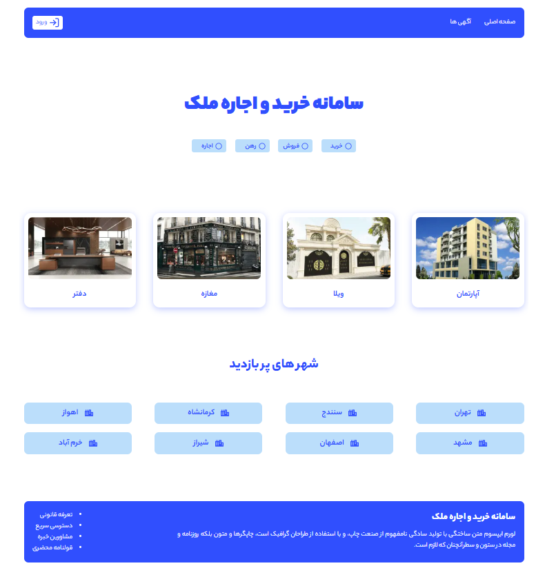
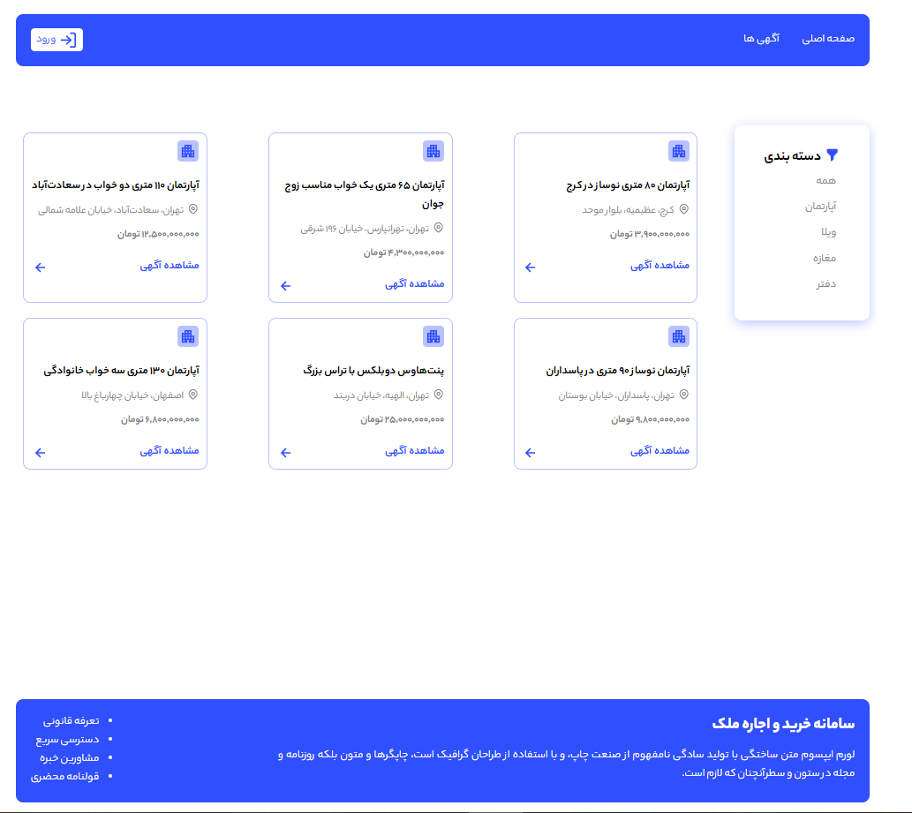
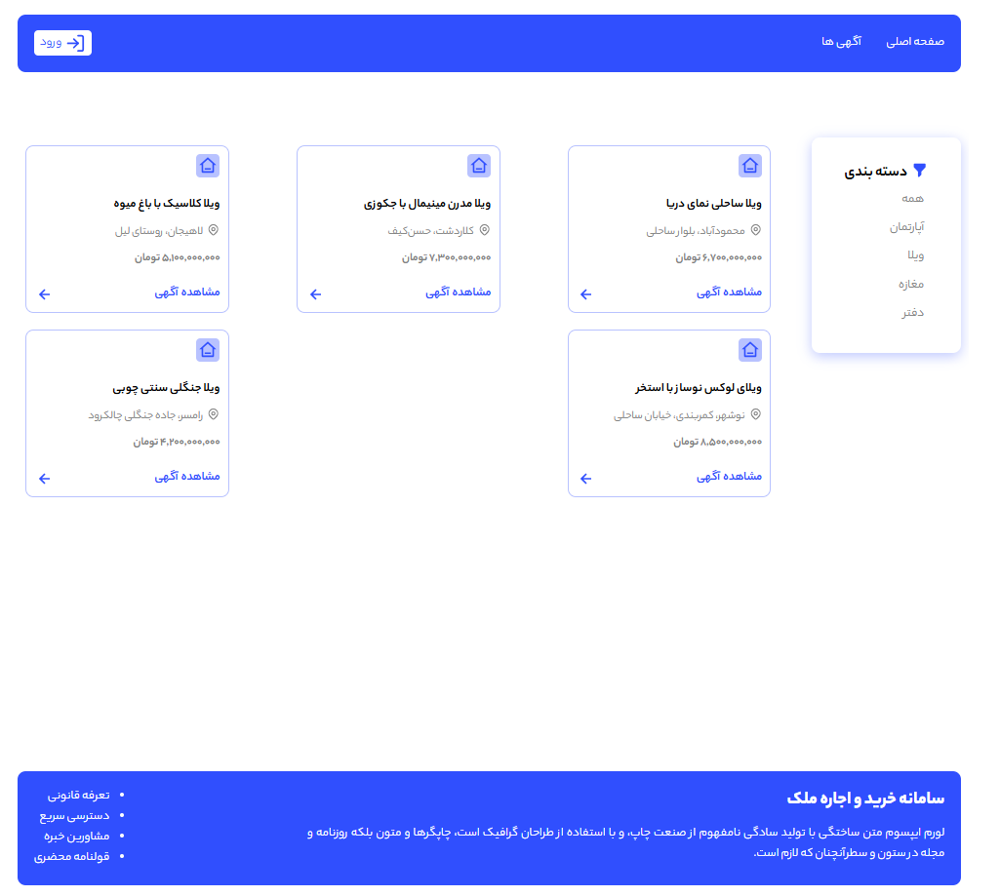
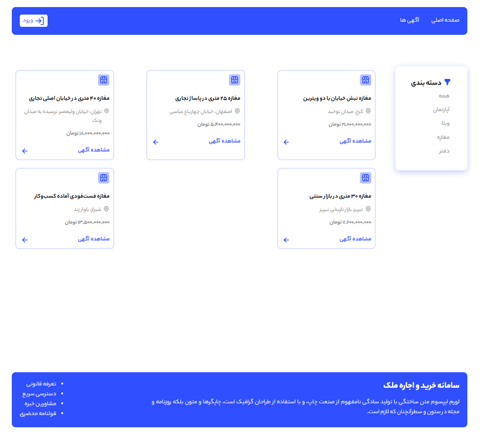
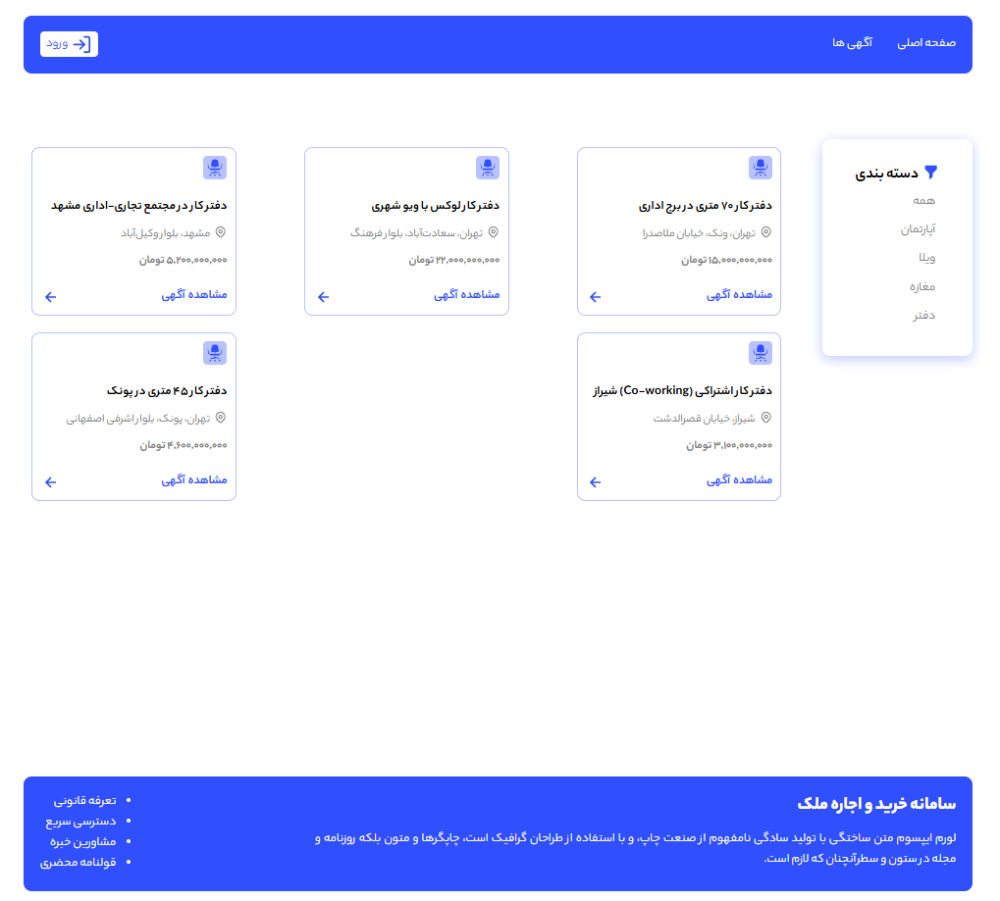
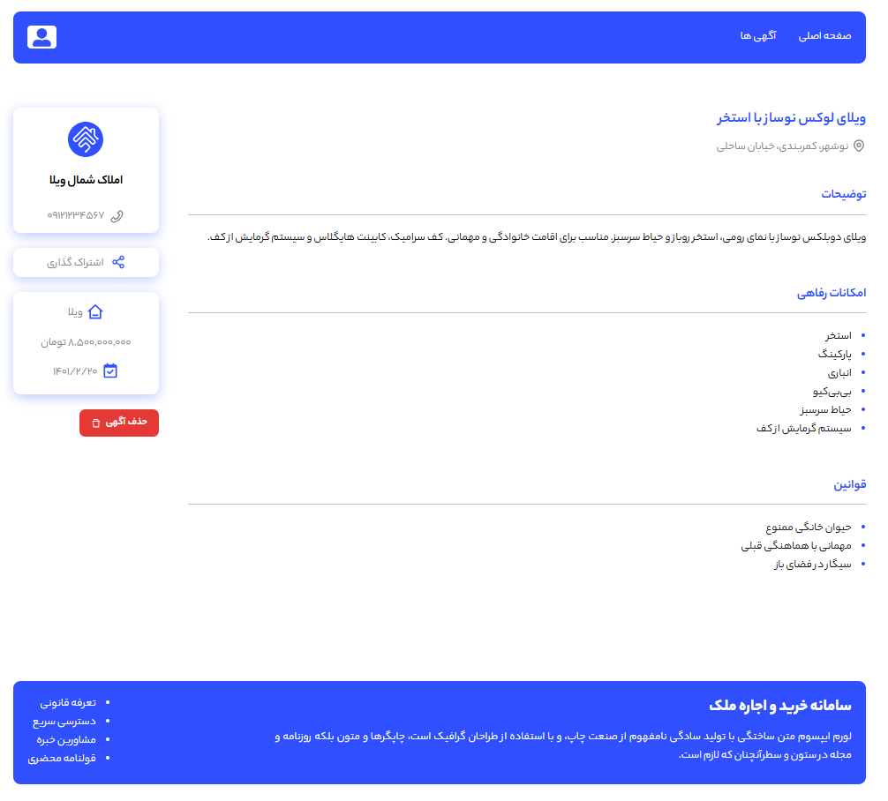
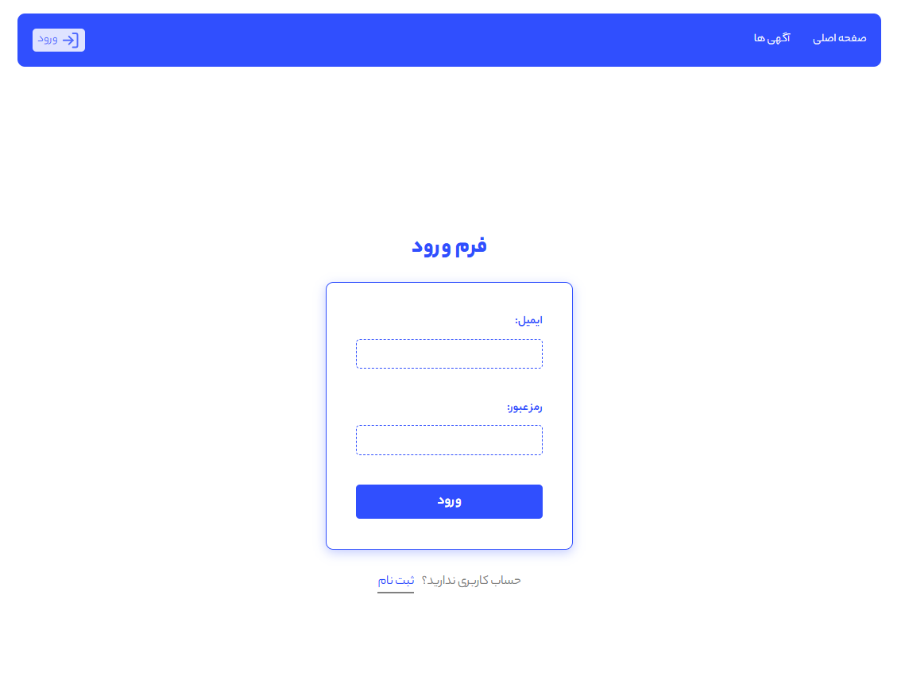
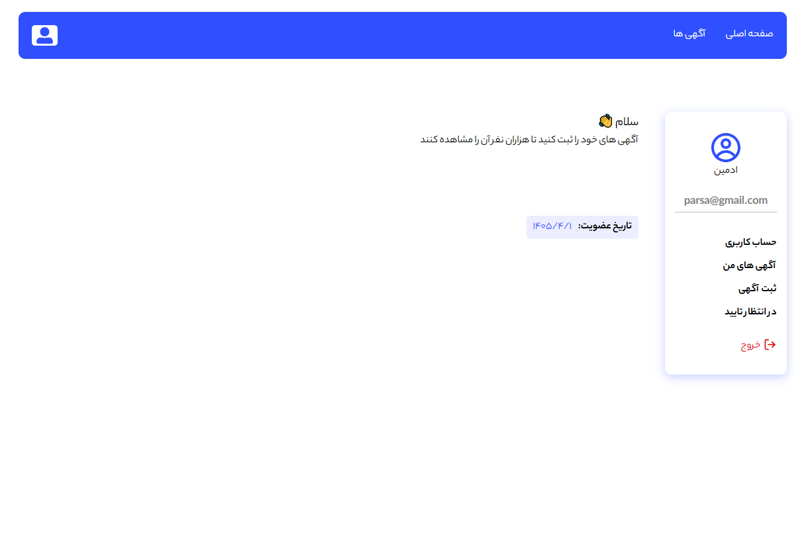
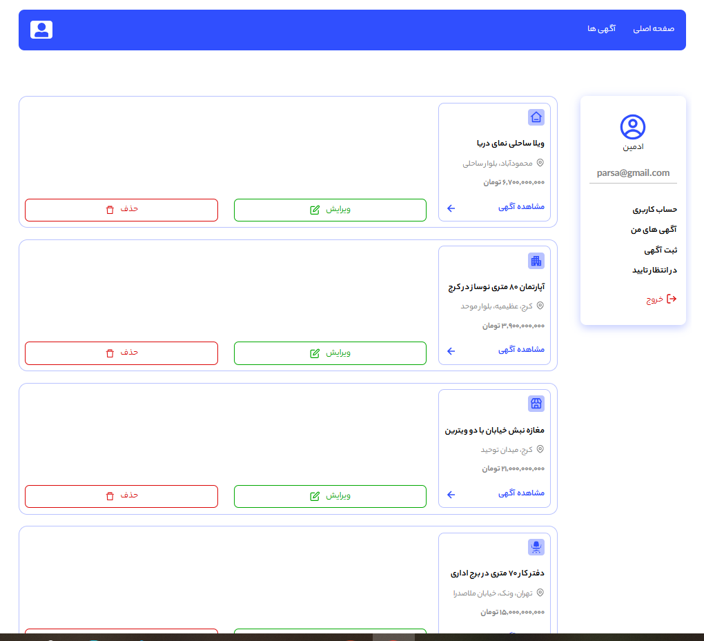
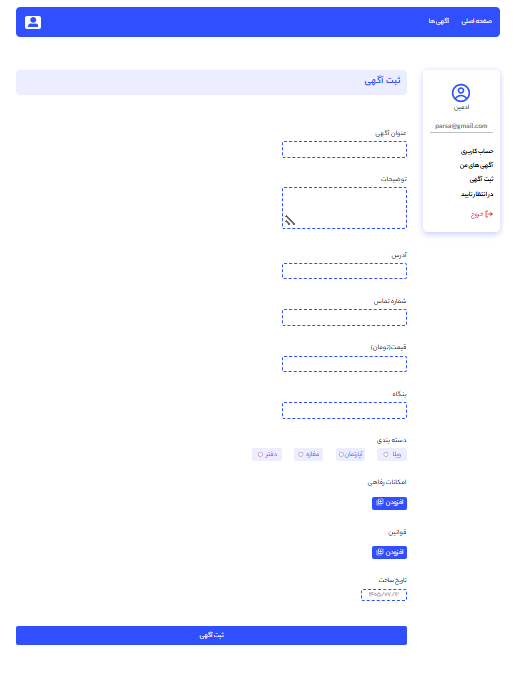
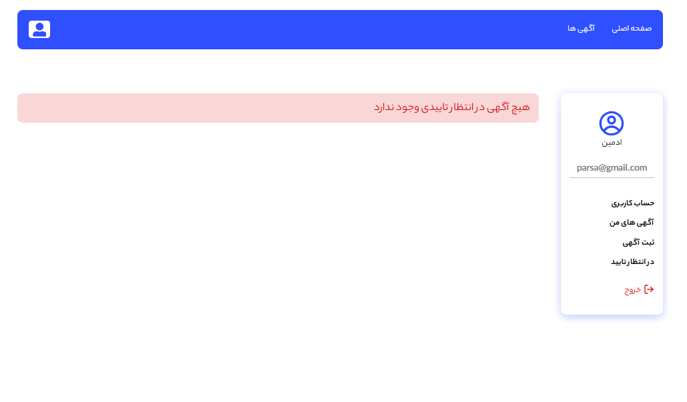

---

## 🚀 تکنولوژی‌ها و ابزارهای استفاده‌شده

### ⚙️ تکنولوژی‌ها

* HTML
* CSS
* JavaScript
* React.js
* Next.js (App Router)
* MongoDB
* NextAuth
* bcryptjs

---

## 🛠 روش نصب و اجرای پروژه

### 📥 نصب

1. کلون کردن ریپازیتوری:

```bash
git clone https://github.com/parsamehrpooshan/Amlak.git
```

2. ورود به پوشه پروژه:

```bash
cd Amlak
```

3. نصب پکیج‌ها:

```bash
npm install
```

4. اجرای پروژه در حالت توسعه:

```bash
npm run dev
```

📍 سپس پروژه روی آدرس زیر در دسترس خواهد بود:

```text
http://localhost:3000
```

---

## 🧪 ویژگی‌های اصلی پروژه

✨ قابلیت‌ها:

* احراز هویت کاربران با JWT و ذخیره‌سازی توکن در کوکی با استفاده از NextAuth
* ثبت‌نام و ورود کاربران با ایمیل و رمز عبور
* رمزنگاری رمز عبور کاربران با استفاده از bcryptjs
* پنل ادمین برای مدیریت آگهی‌ها(ثبت و حذف)
* نمایش و جستجوی آگهی‌های املاک با استفاده از فیلترها
* امکان ثبت آگهی توسط کاربران
* داشبورد کاربری برای مشاهده اطلاعات پروفایل و آگهی های ثبت شده
* مدیریت دسترسی کاربران و ادمین
* ذخیره و مدیریت اطلاعات آگهی‌ها در MongoDB
* طراحی رابط کاربری برای نمایش اطلاعات املاک

---

## 🔐 احراز هویت و سطح دسترسی

سیستم احراز هویت پروژه با استفاده از **NextAuth** پیاده‌سازی شده است.

همچنین با استفاده از سیستم احراز هویت و کنترل دسترسی، امکانات مختلف بر اساس نقش کاربر در اختیار او قرار می‌گیرد:

* 👤 **User:** ثبت آگهی و مدیریت آگهی‌های شخصی
* 👑 **Admin:** مدیریت و بررسی آگهی‌های ثبت‌شده و حذف آگهی‌ها


---

## 🗄 دیتابیس

برای ذخیره‌سازی اطلاعات کاربران و آگهی‌های املاک از **MongoDB** استفاده شده است.

اطلاعاتی مانند:

* اطلاعات کاربران
* اطلاعات آگهی‌ها
* وضعیت تأیید آگهی
* اطلاعات مربوط به مالک آگهی

در دیتابیس ذخیره و مدیریت می‌شوند.

رمز عبور کاربران نیز پیش از ذخیره شدن در دیتابیس با استفاده از **bcryptjs** رمزنگاری می‌شود.

---

## 📞 اطلاعات تماس

📩 ارتباط با من:

* Email: [parsamehrpooshan@gmail.com](mailto:parsamehrpooshan@gmail.com)

---

## ✅ نکات پایانی

* پروژه مستمر آپدیت می‌شود و قابلیت‌های جدیدی به آن اضافه خواهد شد.
* خوشحال می‌شوم اگر پیشنهاد یا بازخوردی برای بهبود پروژه داشتید به من اطلاع دهید 🙌
* اگر پروژه را دوست داشتید، به ریپازیتوری استار بدید ⭐
